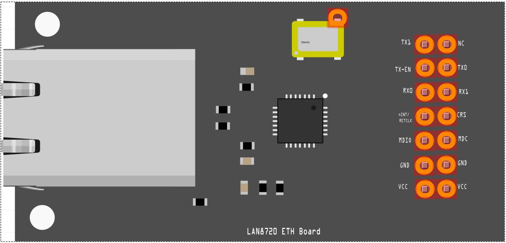
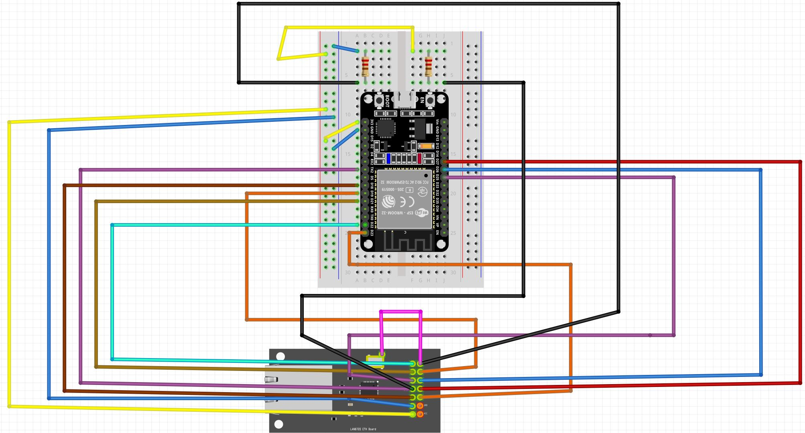

# LAN8720-Fritzing

Fritzing Template for LAN8720

This is a simple Template for Fritzing to add and connect a LAN8720 Breakoutboard.
It also has an additional Port to draw also the Bridge from NC to the enable pin of the Oszi like described here:
https://sautter.com/blog/ethernet-on-esp32-using-lan8720/

If you want to wire it, you can also use this wiring diagram
